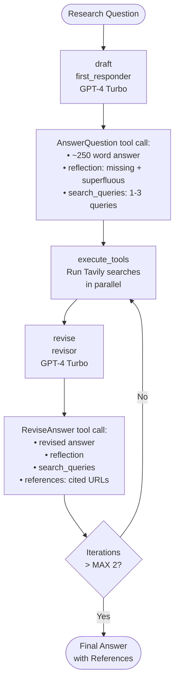

# 🪞 Reflexion Agent

An implementation of the **Reflexion** paper (Shinn et al., 2023) using LangGraph and OpenAI. The agent generates an answer, critiques itself, generates targeted web searches to fill the gaps, and iteratively revises its response — grounding it in real sources and producing a cited, high-quality final answer.

---

## What It Does

Given a research question, the agent runs up to **2 revision loops**, each consisting of:
1. **Draft** — generate a ~250 word answer, a self-critique (what's missing / superfluous), and 1–3 Tavily search queries
2. **Execute tools** — run those search queries in parallel via Tavily
3. **Revise** — incorporate the search results and self-critique to produce a better answer with a references section

This mirrors how a human researcher would work: write a draft → identify weaknesses → look things up → rewrite with citations.

---

## Architecture



---

## Tech Stack

| Component | Technology |
|---|---|
| Graph orchestration | LangGraph `MessageGraph` |
| LLM | OpenAI GPT-4 Turbo |
| Web search | Tavily Search API (batched parallel queries) |
| Structured tool calling | OpenAI function calling + Pydantic schemas |
| Output parsing | `PydanticToolsParser`, `JsonOutputToolsParser` |

---

## Project Structure

```
reflexion-agent/
├── main.py           # LangGraph graph definition + entry point
├── chains.py         # first_responder and revisor chains with prompt templates
├── schemas.py        # Pydantic schemas: Reflection, AnswerQuestion, ReviseAnswer
└── tool_executor.py  # ToolNode wrapping Tavily for parallel query execution
```

---

## Schemas

The agent uses **OpenAI structured tool calling** to enforce output shape at each step:

**`AnswerQuestion`** (used by `first_responder`):
- `answer` — the main response (~250 words)
- `reflection.missing` — what's missing from the answer
- `reflection.superfluous` — what's unnecessary
- `search_queries` — list of 1–3 queries to research improvements

**`ReviseAnswer`** (extends `AnswerQuestion`, used by `revisor`):
- All fields above, plus:
- `references` — list of cited URLs from search results

---

## Setup

```bash
pip install -r requirements.txt
```

Create a `.env` file:
```env
OPENAI_API_KEY=your_openai_key
TAVILY_API_KEY=your_tavily_key
```

Run:
```bash
python main.py
```

Example query (hardcoded in `main.py`):
> *"Write about AI-Powered SOC / autonomous SOC problem domain, list startups that do that and raised capital."*

---

## Key Concepts Demonstrated

- **Reflexion paper implementation** — self-evaluation loop where the agent critiques its own output and uses targeted search to improve it
- **Structured tool calling** — Pydantic schemas enforce the LLM to output richly structured JSON at each step (not just plain text)
- **Parallel tool execution** — multiple search queries are batched and run concurrently via Tavily
- **LangGraph `MessageGraph`** — entire conversation history is passed as state, enabling the revisor to reason over the full context
- **Iterative refinement with citations** — final output is grounded in real sources with a proper references section

---

## Reference

> Shinn, N., Cassano, F., Labash, B., Gopinath, A., Narasimhan, K., & Yao, S. (2023). *Reflexion: Language Agents with Verbal Reinforcement Learning*. [arXiv:2303.11366](https://arxiv.org/abs/2303.11366)
